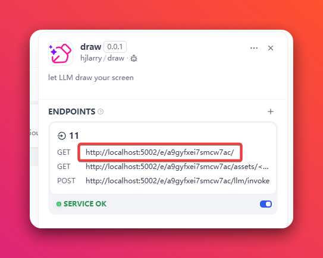
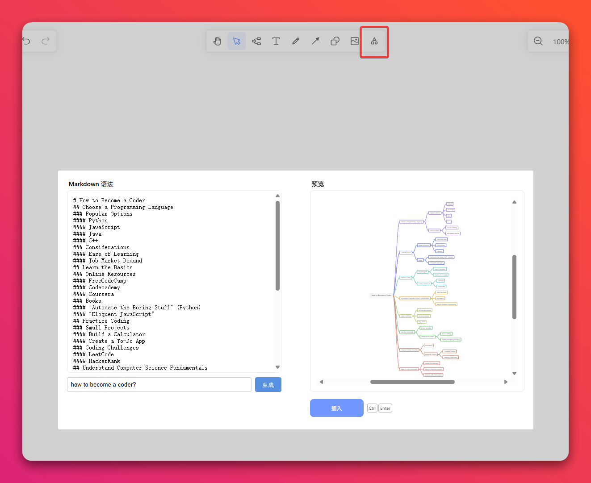
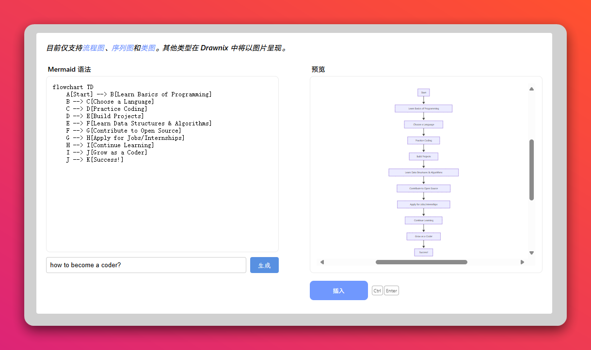

## draw

**Author:** hjlarry  
**Version:** 0.0.1  
**Type:** extension  
**Repo:** https://github.com/hjlarry/dify-plugin-draw  

### Description
Helps you use LLM to generate mind maps and flowcharts on canvas.


This project is based on [drawnix](https://github.com/plait-board/drawnix)


### Usage

#### Step1: Config and open the first endpoint



#### Step2: Open the menu you can enter the prompt to generate a mindmap or a flowchart





### Develop

This project is frontend and backend separated.

The frontend is on this repo:  https://github.com/hjlarry/drawnix   which is a fork of drawnix.

```shell
git clone https://github.com/hjlarry/drawnix
cd drawnix 
npm install
npm run build:web
```

Then copy the `drawnix/dist/apps/web/*` to `endpoints/static/*` will make changes work.
